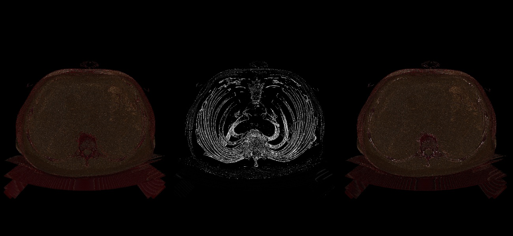

# Information on the stl file
## MM 804 - Graphics and Animations

# Download the required packages in your local system with the given commands.

pip install -r requirements.txt

# Information about medical dataset used

Name: Lung-PET-CT-Dx

Dimension: 29.1 MB or 29,009,518 bytes 

Number of Images: 55

Voxel Resolution: 5mm

Minimum & Maximum pixel intensities: 0 to 255 (Images are 8-bit gray scale) 

## VTK version

vtk==9.1.0

## Setup on Mac and Windows

1. Install Python3 version 3.8.8

   Refer the webiste https://docs.python-guide.org/starting/install3/osx/)

2. Install the requirements package

   pip install -r requirements.txt

3. Run the Script

   python visualizer.py

## OutPut

